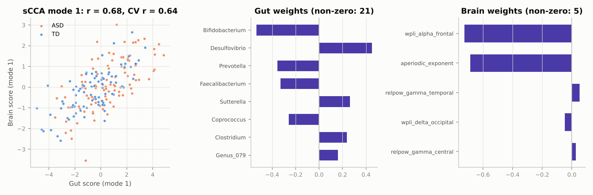

# محور روده–مغز در اوتیسم کودکان (Brain–Gut Axis × ASD)

یک چارچوب کامل و قابل‌اجرا در پایتون برای تحلیل هم‌زمان **میکروبیوم روده**، **سیگنال/تصویر مغز
(EEG، MRI، fMRI)**، **متابولیت‌ها/آزمایش‌ها** و **مقیاس‌های بالینی** در کودکان اوتیسم (ASD) و
کودکان با رشد معمول (TD).

| فایل | محتوا |
|---|---|
| [`docs/datasets.md`](docs/datasets.md) | فهرست دیتاست‌ها، نحوهٔ دسترسی، و متن ایمیل درخواست داده |
| [`docs/model.md`](docs/model.md) | طراحی مدل، ریاضیات، خطاهای رایج، پروتکل جمع‌آوری دادهٔ خودت |
| [`examples/synthetic_run/report.md`](examples/synthetic_run/report.md) | خروجی نمونهٔ کامل پایپ‌لاین روی دادهٔ مصنوعی |

---

## ۱. دیتاست‌ها، به زبان ساده

- **بهترین تطابق (مغز + روده در همان کودکان):**
  - **Mi و همکاران، ۲۰۲۶، *Cell Reports Medicine***: ۳۲۶ کودک ASD و ۱۶۹ کودک TD، سن ۰ تا ۱۰ سال، با MRI ساختاری، متاژنوم روده و متابولوم پلاسما.
  - **Aziz-Zadeh و همکاران، ۲۰۲۵، *Nature Communications***: ۴۳ کودک ASD و ۴۱ کودک نوروتیپیک، با fMRI، متابولومیکس مدفوع و ارزیابی رفتاری.

  داده‌ی هر دو مطالعه را باید **از نویسندگان درخواست** کرد.
- **دیتاست عمومی که هم EEG و هم میکروبیوم را برای همان کودکان اوتیسم داشته باشد پیدا نشد.**
  این یک خلأ پژوهشی واقعی است و برای کار تو یک فرصت است.
- **داده‌های باز قابل‌شروع:**
  - **Kang 2017 (MTT)**: میکروبیوم، متابولیت، CARS، SRS، ABC و GSRS در همان کودکان؛
  - کوهورت‌های 16S و متاژنوم عمومی؛
  - **HBN** با EEG پرچگال و MRI کودکان، و **ABIDE** با rs-fMRI، برای شاخهٔ مغز.
- **روده و مغز در همان افراد، با دانلود مستقیم و بدون درخواست از نویسنده:**
  - **RESONANCE**: ۳۸۱ کودک، متاژنوم + MRI + آزمون‌های شناختی، روی Dryad؛
  - **Khula**: ۱۹۴ نوزاد، متاژنوم + EEG از نوع VEP، روی Dryad؛
  - **MR با آمار خلاصهٔ GWAS**: MiBioGen + BIG40 + PGC-ASD؛
  - **مدل موشی Sharon 2019**.

  این‌ها کوهورت اوتیسم نیستند (به‌جز مدل موشی). ارتباط هر کدام با اوتیسم در بخش «سطح ۰» فایل datasets.md توضیح داده شده است.

جزئیات کامل و لینک‌ها در [`docs/datasets.md`](docs/datasets.md).

## ۲. مدل، به زبان ساده

```
میکروبیوم ─┐                       ┌─> آزمون گروهی (ASD vs TD) با کنترل سن/جنس/رژیم/سایت
متابولیت ──┤──> پیش‌پردازش ──> ────┼─> Sparse CCA: «مُد» مشترک روده–مغز
EEG/MRI ───┤   (CLR، 1/f، wPLI)    ├─> میانجی: میکروب → ویژگی مغزی → علائم (SRS/ADOS)
بالینی ────┘                       └─> پیش‌بینی: تک‌مدالیته + early/late fusion (nested CV)
```

- **لایه ۱:** آیا روده و مغز کودکان ASD متفاوت است؟ برای پاسخ، از CLR، تنوع آلفا و بتا، PERMANOVA و رگرسیون با کنترل مخدوش‌کننده‌ها و تصحیح FDR استفاده می‌شود.
- **لایه ۲:** کدام میکروب‌ها با کدام ویژگی‌های EEG/MRI هم‌تغییرند؟ پاسخ را Sparse CCA می‌دهد، با اعتبارسنجی متقاطع و آزمون جایگشت.
- **لایه ۳:** آیا مسیر «میکروب → مغز → رفتار» با داده سازگار است؟ این را با تحلیل میانجی و bootstrap بررسی می‌کنیم.
- **لایه ۴:** آیا ترکیب داده‌ها پیش‌بینی را بهتر می‌کند؟ برای این کار، late fusion به روش stacking استفاده می‌شود. این روش کودکانی را هم که یکی از داده‌ها را ندارند حذف نمی‌کند.

توضیح کامل و فرمول‌ها در [`docs/model.md`](docs/model.md).

## ۳. اجرای سریع

```bash
cd brain-gut-autism
pip install -r requirements.txt

# دادهٔ مصنوعی با مسیر «روده → مغز → علائم» از پیش کاشته‌شده
python scripts/make_synthetic.py --out data/synthetic

# کل تحلیل + گزارش
python scripts/run_pipeline.py --data data/synthetic --out results/synthetic \
    --covariates age sex site fiber_score \
    --mediation Bifidobacterium:wpli_alpha_frontal:SRS_total

# تست‌ها
python -m pytest -q tests
```

خروجی: `results/synthetic/report.md`، شکل‌ها در `figures/` و همهٔ جدول‌ها به صورت CSV.
اجرای کامل روی ۲۲۰ کودک حدود ۵ دقیقه روی CPU طول می‌کشد. با `--cv-repeats 1 --n-perm 100` سریع‌تر می‌شود.

> ⚠️ **دادهٔ مصنوعی فقط برای یادگرفتن و تست پایپ‌لاین است.** اعداد آن یافتهٔ علمی نیستند.
> اندازهٔ اثرها را خودم دلخواه انتخاب کرده‌ام.

### نتیجهٔ نمونه (دادهٔ مصنوعی) و این‌که پایپ‌لاین چه چیزی را بازیابی کرد

۲۲۰ کودک (۱۲۰ ASD و ۱۰۰ TD) داریم. ۱۸۴ نفر EEG دارند و ۱۶۲ نفر متابولیت. گزارش کامل: [`examples/synthetic_run/report.md`](examples/synthetic_run/report.md).

| لایه | چه چیزی در داده کاشته شده بود | پایپ‌لاین چه پیدا کرد |
|---|---|---|
| تفاوت میکروبیوم | Bifidobacterium، Prevotella و Faecalibacterium در ASD کمتر؛ Desulfovibrio و Clostridium بیشتر | ۶ جنس با q < 0.05 و همه در جهت درست. PERMANOVA معنادار بود (p = 0.001) |
| Sparse CCA | Bifidobacterium و Desulfovibrio بر wPLI آلفای فرونتال و توان 1/f اثر دارند | مُد ۱ دقیقاً همین‌ها را انتخاب کرد: r = 0.68، **CV r = 0.64**، p جایگشت = 0.002 |
| میانجی | Bifidobacterium → wPLI آلفای فرونتال → SRS | اثر غیرمستقیم = ‎−0.135 با بازهٔ اطمینان ۹۵٪ [‎−0.19، ‎−0.09] |
| میکروب–متابولیت | Bifidobacterium → kynurenate و Clostridium → p-cresol | ‎r = 0.68 و ‎r = 0.65 (q < 10⁻¹⁷) |
| پیش‌بینی ASD/TD | سیگنال متوسط و مستقل در روده و مغز | late fusion با AUC = 0.67 روی کودکان کامل بهترین مدل بود. بعد از آن مغز با 0.64 و روده با 0.63 آمدند. early fusion با 0.59 بدترین بود، چون ۲۰۰ ویژگی و فقط ۱۳۹ کودک داشت |
| شدت علائم (SRS، فقط ASD) | SRS از مسیر EEG تعیین می‌شود | پیش‌بینی با EEG به r = 0.48 رسید. میکروبیوم به‌تنهایی تقریباً صفر بود |



**درس‌های این مثال برای دادهٔ واقعی:**
- ادغام فقط وقتی پیش‌بینی را بهتر می‌کند که هر مدالیته اطلاعات *مکمل* داشته باشد.
- early fusion با نمونهٔ کوچک معمولاً بازنده است.
- ارتباط روده–مغز ممکن است قوی باشد (CCA و میانجی)، حتی وقتی قدرت تشخیصی هر بلوک متوسط است. این دو سؤال متفاوت‌اند.

## ۴. اجرا روی دادهٔ واقعی خودت

یک پوشه با این CSVها بساز. ستون اول همهٔ فایل‌ها `subject_id` است.

| فایل | الزامی؟ | محتوا |
|---|---|---|
| `subjects.csv` | ✅ | `group` (ASD/TD)، `age`، `sex` و هر متغیر دیگر مثل `site`، رژیم، BMI، `SRS_total`، `ADOS_CSS`، `CARS_total`، `GSRS_total` |
| `microbiome_counts.csv` | ✅ | شمارش خام ریدها؛ هر ستون یک taxon (مثلاً سطح جنس، از QIIME2/DADA2 یا MetaPhlAn) |
| `brain_features.csv` | اختیاری | ویژگی‌های EEG/MRI/fMRI |
| `metabolites.csv` | اختیاری | شدت متابولیت‌ها یا نتایج آزمایش خون |

**ساخت ویژگی‌های EEG از فایل‌های خام** (EDF، BDF، EEGLAB `.set`، BrainVision، FIF و EGI):

```bash
python scripts/extract_eeg_features.py --files "eeg/sub-*_task-rest_eeg.set" \
    --line-freq 50 --out data/mycohort/brain_features.csv
```

**ساخت ویژگی‌های fMRI از ABIDE** (فقط برای شاخهٔ مغز، چون ABIDE میکروبیوم ندارد):

```python
from gutbrain.fmri import fetch_abide_features
features, phenotypes = fetch_abide_features(data_dir="data/abide")
```

## ۵. ساختار کد

```
gutbrain/
  data.py         بارگذاری و هم‌ترازکردن جدول‌ها
  microbiome.py   فیلتر، CLR، تنوع آلفا و بتا، PERMANOVA، PCoA
  eeg.py          EEG خام → توان باندها، 1/f، فرکانس قلهٔ آلفا، wPLI
  fmri.py         سری زمانی ROI → اتصال عملکردی؛ دانلود ABIDE
  stats.py        آزمون گروهی با covariate و FDR، همبستگی بلوک‌ها، میانجی‌گری
  integration.py  Sparse CCA (Witten 2009) با CV و آزمون جایگشت
  models.py       nested CV: تک‌مدالیته، early fusion، late fusion، رگرسیون شدت
  simulate.py     کوهورت مصنوعی با مسیر شناخته‌شده
  pipeline.py     اجرای همه‌چیز و نوشتن گزارش
scripts/          خط فرمان: make_synthetic، run_pipeline، extract_eeg_features
tests/            ۸ تست بازیابی و end-to-end
```

## ۶. قدم‌های بعدی پیشنهادی

1. پایپ‌لاین را روی دادهٔ مصنوعی اجرا کن و همهٔ خروجی‌ها را بخوان تا با منطق هر لایه آشنا شوی.
2. شاخهٔ EEG را روی **HBN-EEG** (کودکان ASD در برابر TD) امتحان کن. این کار تخصص خودت است و نتیجهٔ مستقلی می‌دهد.
3. شاخهٔ روده را روی **Kang 2017** و کوهورت‌های 16S عمومی اجرا کن، با اعتبارسنجی بین‌کوهورتی.
4. هم‌زمان برای دادهٔ زوج **Mi 2026** و **Aziz-Zadeh 2025** ایمیل بزن و پروتکل جمع‌آوری دادهٔ خودت ([`docs/model.md`](docs/model.md#پروتکل-جمعآوری-داده)) را برای کمیتهٔ اخلاق آماده کن.
5. فرضیه‌های میانجی را **قبل از** دیدن دادهٔ واقعی ثبت کن (OSF). یک نمونه: میکروب‌های مسیر تریپتوفان → اتصال/فعالیت اینسولا یا سینگولیت در فضای منبع EEG → SRS.
