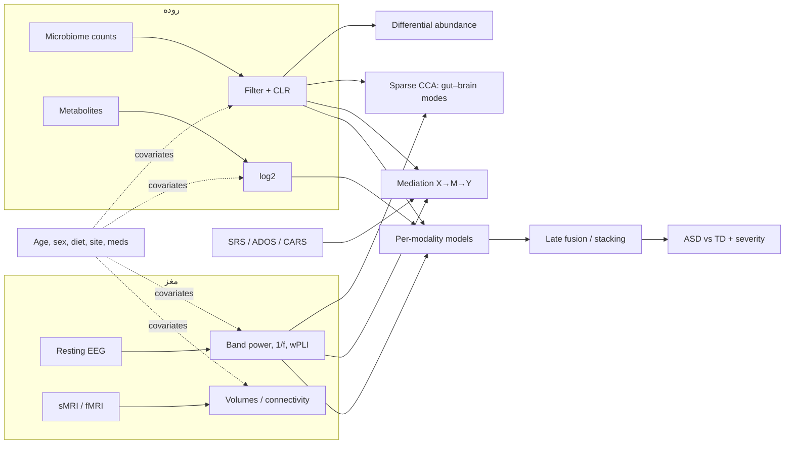

# مدل پیشنهادی: تحلیل چندسطحی محور روده–مغز در اوتیسم

## ایدهٔ اصلی

سؤال علمی سه لایه دارد و هر لایه ابزار خودش را می‌خواهد:

| سؤال | ابزار در این مخزن |
|---|---|
| ۱. آیا روده و مغز کودکان ASD با TD فرق دارد؟ | آزمون‌های تک‌متغیره با کنترل متغیرهای مخدوش‌کننده + FDR، تنوع آلفا/بتا، PERMANOVA |
| ۲. آیا تغییرات روده با تغییرات مغز **هم‌تغییر** است؟ | **Sparse CCA** بین بلوک میکروبیوم و بلوک EEG/MRI؛ همبستگی میکروب–متابولیت |
| ۳. آیا مسیر «میکروب → مغز → علائم» با داده سازگار است؟ | **تحلیل میانجی (mediation)** با bootstrap |
| ۴. آیا ترکیب داده‌ها تشخیص/شدت را بهتر پیش‌بینی می‌کند؟ | طبقه‌بندهای تک‌مدالیته، **early fusion** و **late fusion (stacking)** با nested CV |

---

## لایه ۰ — پیش‌پردازش هر مدالیته

### میکروبیوم (`gutbrain/microbiome.py`)
- **فیلتر:** حذف taxaهایی که در کمتر از ۱۰٪ نمونه‌ها حضور دارند.
- **CLR (centred log-ratio):** داده‌های توالی‌یابی *ترکیبی* (compositional) هستند؛ فقط نسبت‌ها
  معنی دارند. $\mathrm{clr}(x)_j = \log x_j - \frac{1}{D}\sum_k \log x_k$
- **تنوع آلفا** (Shannon، richness، inverse Simpson) با کنترل عمق توالی‌یابی.
- **تنوع بتا:** فاصلهٔ Aitchison (اقلیدسی روی CLR) و **PERMANOVA**، بعد از حذف اثر متغیرهای مخدوش‌کننده.
- برای مقالهٔ نهایی، نتایج differential abundance را با **ANCOM-BC2** یا **MaAsLin2** (در R) هم تأیید کن.

### EEG (`gutbrain/eeg.py`) — حوزهٔ تخصصی تو
- notch (۵۰ هرتز در ایران / ۶۰ هرتز برای HBN)، فیلتر ۱–۴۵ هرتز، رفرنس متوسط، epochهای ۲ ثانیه‌ای، حذف epochهای پرنویز.
- **ویژگی‌ها:** توان نسبی ۵ باند × ۵ ناحیه، نسبت تتا/بتای فرونتال، فرکانس قلهٔ آلفا،
  **توان ناپریودیک (1/f exponent)** به‌عنوان شاخص تعادل تحریک/مهار (E/I)، و
  **wPLI** (حساسیت کم به هدایت حجمی) به صورت میانگین سراسری و قدرت گره‌ای هر ناحیه.
- **گسترش با source localization:** همین توابع را روی سری زمانی labelها (مثلاً اطلس Desikan
  با `mne.extract_label_time_course` یا خروجی Brainstorm) اجرا کن تا ویژگی‌ها در فضای منبع
  باشند (مثلاً اینسولا و سینگولیت که در Aziz-Zadeh 2025 گزارش شده‌اند).
- برای کودکان ASD که چشم‌بسته‌ماندن برایشان سخت است، **EEG حین تماشای ویدیوی آرام** (مثل پروتکل HBN) گزینهٔ خوبی است.

### MRI / fMRI (`gutbrain/fmri.py`)
- sMRI: حجم/ضخامت قشر از FreeSurfer (`asegstats2table`، `aparcstats2table`) ⇒ یک CSV.
- rs-fMRI: سری زمانی ROI ⇒ اتصال عملکردی (Fisher-z)؛ با برچسب شبکه (Yeo-7) خلاصهٔ درون/بین شبکه‌ای.

### متابولیت‌ها و آزمایش‌ها
- log2 شدت‌ها؛ متابولیت‌های کلیدی: SCFAها (butyrate، propionate)، مسیر تریپتوفان
  (kynurenate، indole-3-propionate، serotonin)، p-cresol sulfate، 4-ethylphenyl sulfate، GABA.
- آزمایش‌های خون (مثل CRP، سایتوکاین‌ها، ویتامین D، آهن) را هم می‌توانی به‌عنوان یک بلوک جدا اضافه کنی.

---

## لایه ۱ — مقایسهٔ گروهی

برای هر ویژگی:  $\text{feature} = \beta_0 + \beta_1\,\text{ASD} + \boldsymbol\gamma^\top \text{covariates} + \varepsilon$
اندازهٔ اثر = $\beta_1 / \mathrm{SD}$ و تصحیح چندگانه با **Benjamini–Hochberg (FDR)**.

**متغیرهای مخدوش‌کنندهٔ ضروری:** سن، جنس، **رژیم غذایی** (Yap 2021 نشان داد بخش بزرگی از
ارتباط اوتیسم–میکروبیوم از رژیم انتخابی می‌آید)، BMI، داروها (مثلاً ریسپریدون)، آنتی‌بیوتیک در
۳ ماه اخیر، پروبیوتیک، علائم گوارشی، سایت/بچ توالی‌یابی، و برای EEG: تعداد epoch تمیز و حالت ضبط.

## لایه ۲ — ادغام روده و مغز: Sparse CCA

به دنبال بردارهای وزن تُنُک $u$ (روی taxaها) و $v$ (روی ویژگی‌های مغزی) هستیم:

$$
\max_{u,v}\; u^\top X^\top Y v \quad \text{s.t.}\; \|u\|_2\le1,\ \|v\|_2\le1,\ \|u\|_1\le c_x,\ \|v\|_1\le c_y
$$

(الگوریتم Penalized Matrix Decomposition؛ Witten و همکاران ۲۰۰۹). خروجی یک «مُد محور روده–مغز»
است: مجموعهٔ کوچکی از میکروب‌ها که با مجموعهٔ کوچکی از ویژگی‌های EEG هم‌تغییرند.
- پنالتی‌ها با **اعتبارسنجی متقاطع** انتخاب می‌شوند؛ همبستگی خارج از نمونه (CV r) معیار صادقانهٔ اثر است.
- معناداری با **آزمون جایگشت** (جابه‌جایی سطرهای Y).
- هر دو بلوک قبلش روی متغیرهای مخدوش‌کننده residualize می‌شوند.
- **هشدار:** وزن‌های CCA با نمونهٔ کوچک ناپایدارند (Helmer و همکاران ۲۰۲۴)؛ با n حدود ۱۰۰ تا ۲۰۰، تعداد
  ویژگی‌ها را از قبل و بر اساس فرضیه محدود کن (مثلاً ۱۵ تا ۲۰ جنس + ۱۰ تا ۲۰ ویژگی EEG).

## لایه ۳ — تحلیل میانجی

$$
M = a X + \gamma_1^\top C,\qquad Y = b M + c' X + \gamma_2^\top C
$$
اثر غیرمستقیم = $a\times b$ با بازهٔ اطمینان **bootstrap** (۲۰۰۰ بار). مثال:
`Bifidobacterium → wPLI آلفای فرونتال → SRS`.
- فرضیه‌ها را **قبل از دیدن داده** مشخص کن (pre-registration)؛ انتخاب X و M از روی همان داده = دور باطل.
- میانجی در دادهٔ مقطعی «سازگار با» مسیر علّی است، نه «اثبات» آن. برای علیت: دادهٔ طولی
  (مثل Kang 2017)، مداخله (پروبیوتیک/FMT) یا Mendelian randomization.

## لایه ۴ — پیش‌بینی (`gutbrain/models.py`)

- **مدل پایه:** حذف اثر covariates (فقط روی دادهٔ آموزشی هر fold) → استانداردسازی → رگرسیون لجستیک L2.
- **Nested CV:** حلقهٔ بیرونی ۵-fold (× چند تکرار) برای ارزیابی؛ حلقهٔ درونی ۵-fold برای تنظیم C.
- **Early fusion:** الحاق همهٔ بلوک‌ها (فقط کودکانی که همهٔ داده‌ها را دارند)، با وزن $1/\sqrt{p}$ برای هر بلوک.
- **Late fusion (stacking):** هر بلوک مدل خودش را دارد؛ logitهای خارج از fold استاندارد می‌شوند و یک
  رگرسیون لجستیک متا روی آن‌ها آموزش می‌بیند. **کودکی که EEG ندارد هم پیش‌بینی می‌گیرد**
  (logit آن بلوک = ۰، یعنی بی‌اطلاع). این در کوهورت‌های واقعی اوتیسم که داده‌ی ناقص زیاد است حیاتی است.
- **شدت علائم:** رگرسیون Ridge روی SRS / ADOS-CSS / CARS فقط در گروه ASD.
- ستون `AUC_complete_cases` همهٔ مدل‌ها را روی **همان کودکان** مقایسه می‌کند.

### چرا یادگیری عمیق نه (فعلاً)؟
با چند صد کودک، مدل‌های عمیق چندمدالیته تقریباً همیشه overfit می‌کنند. وقتی n بزرگ شد (مثلاً
> ۵۰۰) یا خواستی از پیش‌آموزش روی HBN-EEG استفاده کنی، گزینه‌ها: **multimodal VAE** با
modality dropout، **GNN** روی ماتریس wPLI + embedding میکروبیوم، یا روش‌های فاکتوری مثل
**MOFA+** و **DIABLO (mixOmics)** که برای n کوچک مناسب‌ترند.

---

## خطاهای رایج که باید از آن‌ها دوری کرد

1. **نشت اطلاعات (leakage):** هر چیزی که از برچسب استفاده می‌کند (انتخاب ویژگی، تنظیم پارامتر،
   حذف covariates) باید داخل fold انجام شود. این مخزن این کار را انجام می‌دهد.
2. **ادغام افراد متفاوت:** میکروبیوم کوهورت X را نمی‌شود با EEG کوهورت Y «fuse» کرد.
3. **نادیده‌گرفتن رژیم غذایی و دارو** ⇒ نتیجهٔ کاذب «میکروبیوم اوتیسم».
4. **نسبت کاذب از داده‌ی ترکیبی:** هرگز روی فراوانی نسبی خام همبستگی نگیر؛ CLR یا روش‌های ترکیبی.
5. **کنترل‌های نامناسب:** Morton 2023 دید الگو در کنترل‌های خواهر/برادری از بین می‌رود؛ نوع گروه کنترل را گزارش کن.
6. **تفسیر علّی از دادهٔ مقطعی.**
7. **گزارش فقط دقت:** AUC، دقت متوازن، بازهٔ اطمینان و نتیجهٔ آزمون جایگشت را گزارش کن.

---

## پروتکل جمع‌آوری داده

پیشنهاد برای یک مطالعهٔ مقطعی در ایران (قابل اجرا در یک کلینیک اوتیسم + آزمایشگاه EEG):

| مؤلفه | جزئیات |
|---|---|
| **نمونه** | حداقل ۶۰ ASD + ۶۰ TD هم‌سن (۴ تا ۱۲ سال)؛ در صورت امکان خواهر/برادر به‌عنوان کنترل دوم |
| **EEG** | ۵ دقیقه چشم‌باز + ۵ دقیقه چشم‌بسته یا تماشای ویدیوی آرام؛ ≥ ۳۲ کانال؛ ضبط مختصات الکترود برای source localization؛ امپدانس و یادداشت رفتار حین ضبط |
| **نمونهٔ مدفوع** | کیت پایدارکننده (مثل OMNIgene-GUT یا DNA/RNA Shield)، فریز ۸۰- درجه؛ **16S V3–V4** (ارزان‌تر) یا **متاژنوم شاتگان** (سطح گونه و مسیرهای عملکردی)؛ در صورت بودجه: متابولومیکس مدفوع هدفمند (SCFA و مسیر تریپتوفان) |
| **آزمایش خون (اختیاری)** | CRP، IL-6، TNF-α، تریپتوفان/کینورنین سرم، ویتامین D، فریتین |
| **ارزیابی بالینی** | ADOS-2 یا CARS-2 (تشخیص و شدت)، SRS-2، ABC، **GSRS** یا 6-GSI (علائم گوارشی)، مقیاس بریستول مدفوع، پرسشنامهٔ خواب (CSHQ) |
| **مخدوش‌کننده‌ها** | پرسشنامهٔ بسامد غذایی (FFQ) یا یادآمد ۳ روزه، قد/وزن، داروها، آنتی‌بیوتیک/پروبیوتیک ۳ ماه اخیر، نوع زایمان و تغذیهٔ نوزادی |
| **معیار خروج** | مصرف آنتی‌بیوتیک در ۱ تا ۳ ماه اخیر، بیماری التهابی روده، صرع کنترل‌نشده، سندرم‌های ژنتیکی شناخته‌شده (یا گزارش جداگانه) |
| **اخلاق** | کد اخلاق، رضایت آگاهانهٔ والدین، ناشناس‌سازی؛ ثبت پروتکل و فرضیه‌ها (OSF) قبل از تحلیل |

**قالب دادهٔ نهایی** همان CSVهای `gutbrain/data.py` است، پس کل پایپ‌لاین بدون تغییر اجرا می‌شود.

---

## منابع روش‌شناختی
- Witten, Tibshirani & Hastie (2009). *A penalized matrix decomposition…* Biostatistics.
- Vinck et al. (2011). *An improved index of phase-synchronization…* (wPLI). NeuroImage.
- Gloor et al. (2017). *Microbiome datasets are compositional: and this is not optional.* Front Microbiol.
- Anderson (2001). *A new method for non-parametric multivariate analysis of variance.* Austral Ecology.
- Yap et al. (2021). *Autism-related dietary preferences mediate autism–gut microbiome associations.* Cell.
- Morton et al. (2023). *Multi-level analysis of the gut–brain axis…* Nature Neuroscience.
- Helmer et al. (2024). *On the stability of canonical correlation analysis and partial least squares…* Communications Biology.
