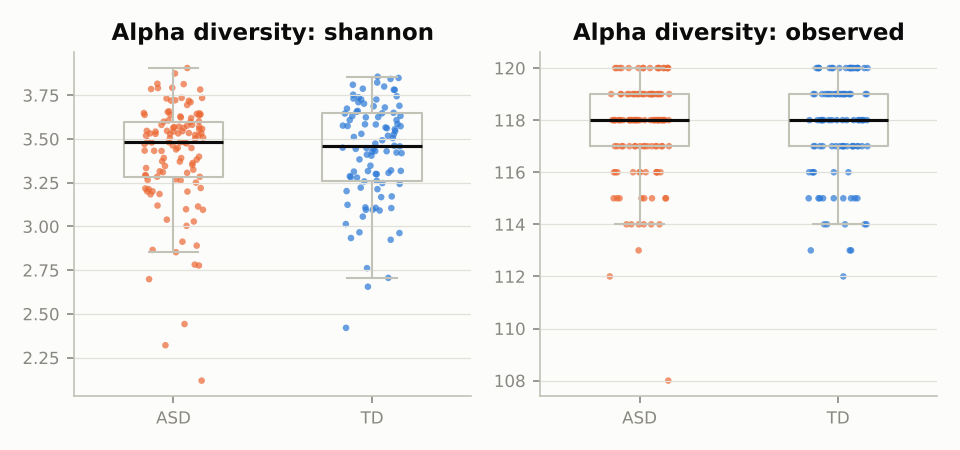
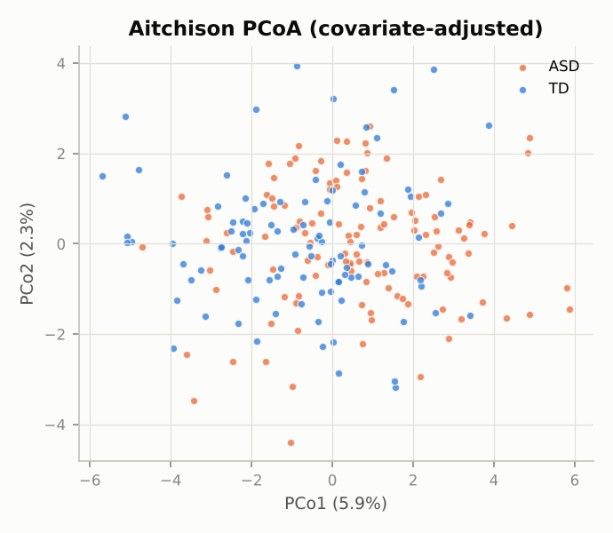
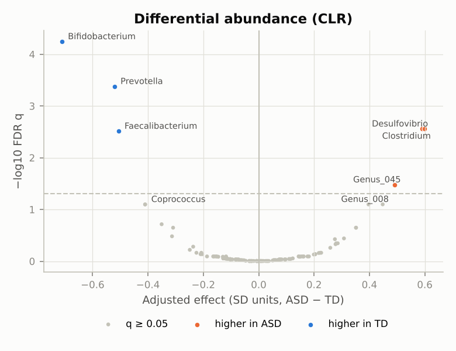
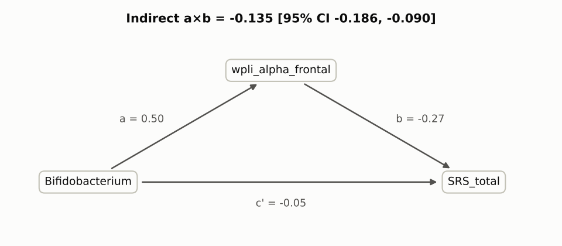
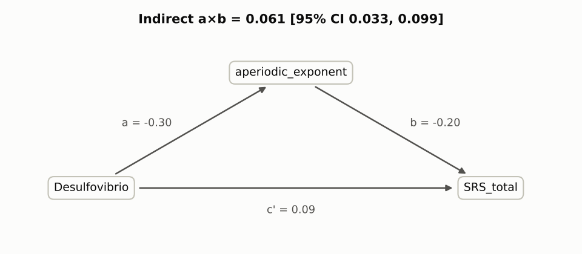
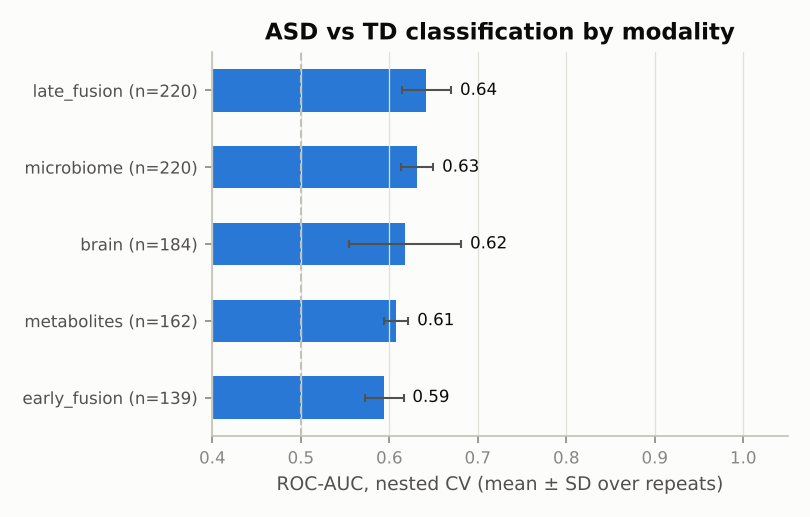

# Gut–brain axis analysis report

```
subjects: 220 {'ASD': 120, 'TD': 100}
microbiome: 220 subjects x 120 features
brain: 184 subjects x 59 features
metabolites: 162 subjects x 30 features
```

Covariates regressed out / adjusted for: `age, fiber_score, sex_M, site_site_B`

## 1. Microbiome

116 of 120 taxa kept (prevalence ≥ 10%); CLR-transformed.

**Alpha diversity** (adjusted for covariates and log sequencing depth):

| feature | effect_d | p_value | q_value |
|---|---|---|---|
| observed | -0.111 | 0.396 | 0.776 |
| shannon | 0.104 | 0.517 | 0.776 |
| inv_simpson | -0.0144 | 0.928 | 0.928 |

**Beta diversity**: PERMANOVA on covariate-residualized Aitchison distance — pseudo-F = 1.89, R² = 0.009, p = 0.001

 

**Differential abundance** (CLR ~ group + covariates, BH-FDR): 6 taxa with q < 0.05. Top 10:

| feature | effect_d | mean_ASD | mean_TD | q_value |
|---|---|---|---|---|
| Bifidobacterium | -0.711 | 1.2 | 2.6 | 5.7e-05 |
| Prevotella | -0.521 | 0.854 | 2.25 | 0.000419 |
| Desulfovibrio | 0.59 | 2 | 1.02 | 0.00277 |
| Clostridium | 0.6 | 2.58 | 1.88 | 0.00277 |
| Faecalibacterium | -0.507 | 2.29 | 3.21 | 0.00307 |
| Genus_045 | 0.491 | -1.41 | -1.86 | 0.0333 |
| Genus_008 | 0.448 | -0.12 | -0.362 | 0.0795 |
| Coprococcus | -0.41 | 1.02 | 1.68 | 0.0798 |
| Parabacteroides | 0.397 | 2.49 | 2.09 | 0.0798 |
| Genus_073 | -0.411 | -1.72 | -1.56 | 0.0798 |



## 2a. Brain — ASD vs TD

184 subjects × 59 features; 1 with q < 0.05. Top 10:

| feature | effect_d | mean_ASD | mean_TD | q_value |
|---|---|---|---|---|
| relpow_gamma_temporal | 0.689 | 0.0601 | 0.0495 | 0.00217 |
| wpli_theta_parietal | 0.492 | 0.155 | 0.142 | 0.105 |
| theta_beta_ratio_frontal | 0.469 | 2.81 | 2.42 | 0.105 |
| aperiodic_exponent | -0.31 | 1.56 | 1.61 | 0.359 |
| wpli_beta_temporal | 0.375 | 0.157 | 0.149 | 0.359 |
| relpow_theta_temporal | -0.356 | 0.192 | 0.201 | 0.395 |
| alpha_peak_freq | -0.236 | 8.88 | 9.06 | 0.532 |
| relpow_delta_occipital | 0.227 | 0.325 | 0.31 | 0.532 |
| relpow_alpha_occipital | -0.235 | 0.31 | 0.332 | 0.539 |
| wpli_beta_occipital | 0.257 | 0.152 | 0.147 | 0.618 |

## 2b. Metabolites — ASD vs TD

162 subjects × 30 features; 2 with q < 0.05. Top 10:

| feature | effect_d | mean_ASD | mean_TD | q_value |
|---|---|---|---|---|
| p_cresol_sulfate | 0.64 | 15.4 | 14.7 | 0.012 |
| kynurenate | -0.567 | 14.3 | 15.1 | 0.023 |
| 4_ethylphenyl_sulfate | 0.499 | 15.3 | 14.9 | 0.0609 |
| indole_3_propionate | -0.489 | 14.5 | 15.1 | 0.0609 |
| serotonin | 0.479 | 15.4 | 15.1 | 0.0621 |
| metabolite_04 | -0.431 | 15 | 15.3 | 0.0989 |
| hydrogen_sulfide_proxy | 0.417 | 15.3 | 14.7 | 0.0989 |
| GABA | -0.4 | 14.7 | 15.3 | 0.102 |
| metabolite_13 | 0.304 | 15 | 14.9 | 0.353 |
| metabolite_06 | 0.291 | 15.2 | 15 | 0.371 |

## 3. Gut ↔ brain integration (sparse CCA)

n = 184 children with both blocks; both residualized on covariates. Mode 1: in-sample r = 0.68, cross-validated r = 0.64, permutation p = 0.002 (500 permutations).

- Gut side: Bifidobacterium (-0.53), Desulfovibrio (+0.45), Prevotella (-0.35), Faecalibacterium (-0.33), Sutterella (+0.26), Coprococcus (-0.26)
- Brain side: wpli_alpha_frontal (-0.73), aperiodic_exponent (-0.68), relpow_gamma_temporal (+0.05), wpli_delta_occipital (-0.05), relpow_gamma_central (+0.03)


### Taxa ↔ metabolite links (top differential taxa, Spearman, residualized)

| feature_a | feature_b | r | p_value | q_value |
|---|---|---|---|---|
| Bifidobacterium | kynurenate | 0.683 | 1.23e-23 | 5.54e-21 |
| Clostridium | p_cresol_sulfate | 0.649 | 9.44e-21 | 2.12e-18 |
| Clostridium | indole_3_propionate | -0.625 | 6.37e-19 | 9.56e-17 |
| Desulfovibrio | hydrogen_sulfide_proxy | 0.613 | 4.65e-18 | 5.23e-16 |
| Desulfovibrio | kynurenate | -0.569 | 2.84e-15 | 2.56e-13 |
| Clostridium | 4_ethylphenyl_sulfate | 0.55 | 3.57e-14 | 2.67e-12 |
| Bifidobacterium | indole_3_propionate | 0.529 | 4.49e-13 | 2.89e-11 |
| Prevotella | kynurenate | 0.487 | 5.04e-11 | 2.84e-09 |
| Faecalibacterium | butyrate | 0.479 | 1.19e-10 | 5.94e-09 |
| Bifidobacterium | GABA | 0.457 | 9.95e-10 | 4.48e-08 |

## 4. Mediation (hypothesis-driven)

Specified a priori; adjusted for covariates and diagnosis. Cross-sectional mediation is compatible with, not proof of, a causal chain.




| X | M | Y | n | a_path | b_path | indirect_ab | indirect_ci_low | indirect_ci_high | indirect_p_boot |
|---|---|---|---|---|---|---|---|---|---|
| Bifidobacterium | wpli_alpha_frontal | SRS_total | 184 | 0.501 | -0.268 | -0.135 | -0.186 | -0.0904 | 0.0005 |
| Desulfovibrio | aperiodic_exponent | SRS_total | 184 | -0.303 | -0.203 | 0.0614 | 0.0327 | 0.0993 | 0.0005 |

## 5. Prediction of diagnosis (nested CV)

Outer 5-fold × 3 repeats, inner 5-fold tuning; covariates regressed out inside each training fold. Late fusion stacks the per-block logits, so children with a missing block are still scored. `AUC_complete_cases` scores every model on the same children (those with all blocks) for a like-for-like comparison.

| model | AUC_mean | AUC_sd | AUC_complete_cases | balanced_acc | n_subjects |
|---|---|---|---|---|---|
| late_fusion | 0.642 | 0.0279 | 0.668 | 0.615 | 220 |
| microbiome | 0.631 | 0.0182 | 0.628 | 0.6 | 220 |
| brain | 0.618 | 0.0632 | 0.638 | 0.581 | 184 |
| metabolites | 0.608 | 0.0136 | 0.621 | 0.588 | 162 |
| early_fusion | 0.594 | 0.0219 | 0.594 | 0.579 | 139 |

Mean late-fusion weight per block: microbiome = 0.32, brain = 0.37, metabolites = 0.16



Top features — microbiome (mean standardized coefficient over folds; sign stability = share of folds agreeing in sign):

| feature | mean_coef | sign_stability |
|---|---|---|
| Bifidobacterium | -0.0445 | 1 |
| Prevotella | -0.0362 | 1 |
| Genus_000 | 0.0316 | 1 |
| Clostridium | 0.0314 | 1 |
| Genus_103 | 0.0302 | 1 |
| Genus_073 | -0.0297 | 1 |
| Genus_056 | -0.0293 | 1 |
| Genus_045 | 0.0287 | 1 |

Top features — brain (mean standardized coefficient over folds; sign stability = share of folds agreeing in sign):

| feature | mean_coef | sign_stability |
|---|---|---|
| relpow_gamma_temporal | 1 | 1 |
| wpli_delta_global | 0.887 | 1 |
| wpli_beta_global | -0.696 | 1 |
| wpli_theta_parietal | 0.668 | 1 |
| theta_beta_ratio_frontal | 0.571 | 1 |
| wpli_delta_occipital | -0.552 | 1 |
| wpli_gamma_temporal | -0.551 | 1 |
| wpli_beta_temporal | 0.45 | 1 |

Top features — metabolites (mean standardized coefficient over folds; sign stability = share of folds agreeing in sign):

| feature | mean_coef | sign_stability |
|---|---|---|
| metabolite_04 | -0.126 | 1 |
| p_cresol_sulfate | 0.106 | 1 |
| metabolite_06 | 0.0846 | 1 |
| kynurenate | -0.0753 | 1 |
| metabolite_12 | 0.0745 | 1 |
| hydrogen_sulfide_proxy | 0.0662 | 1 |
| metabolite_08 | -0.0589 | 1 |
| metabolite_13 | 0.0574 | 0.933 |

### Symptom severity within ASD: `SRS_total` (ridge, 5-fold CV)

| block | n | r | R2 | MAE |
|---|---|---|---|---|
| microbiome | 120 | 0.0383 | -0.0139 | 6.29 |
| brain | 100 | 0.479 | 0.211 | 5.63 |
| metabolites | 87 | 0.0716 | 0.0014 | 6.11 |

